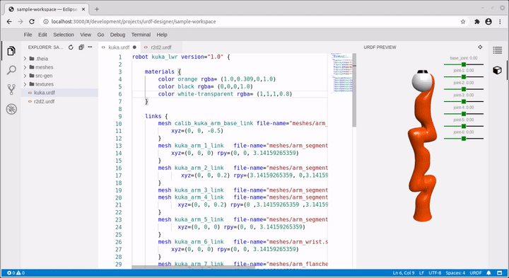
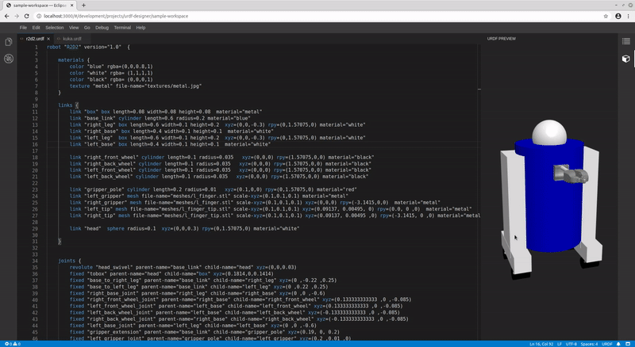

# urdf-designer
[Theia](https://theia-ide.org) based demo application used to design URDF models by means of a simplified domain specific language.

Most interesting aspects the demo covers:

* Eclipse XText based language server protocol (LSP) implementation deployed in a Spring Boot application
* LSP websocket communication between Theia backend and Spring backend
* Shows how to forward certain HTTP requests to Spring backend by using the http-proxy module
* Generates real URDF XML models from simplified DSL sources

You can build your own docker image to try out the editor:

* docker build -t urdf-designer .
* docker run  -v workspace:/workspace -p  8080:80 urdf-designer
* open your browser http://localhost:8080/#/workspace

